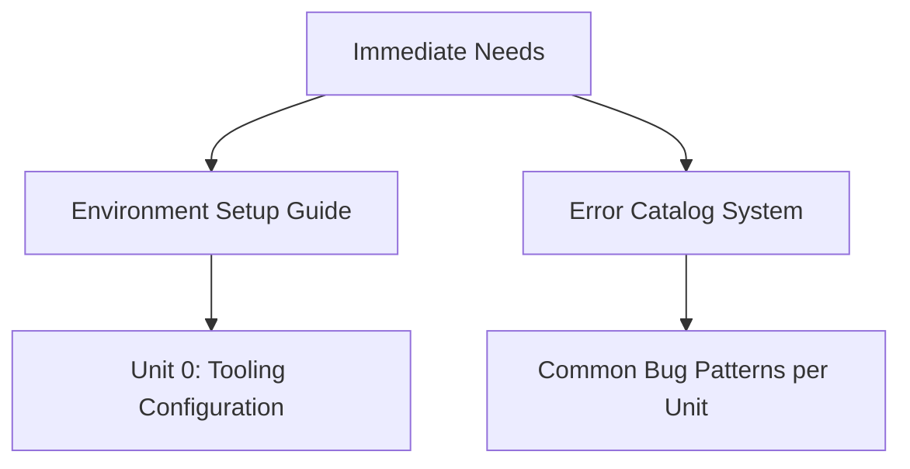

# Consensus Critique Summary of AI Curriculum Generation Approach

## Top Common Improvement Areas Across All Analyses

1. **Iterative Feedback Loops Needed**

   - All critiques note the linear 1->2->3 flow lacks feedback mechanisms
   - Suggested: Add cross-step validation (e.g., Step 3 outputs should inform Step 2 revisions)
   - Example: Assignment creation might reveal flawed unit objectives requiring course outline changes

2. **Assessment Diversity Gap**

   - Over-reliance on coding assignments/unit tests (mentioned in 5/5 critiques)
   - Recommended additions:
     ```markdown
     - Conceptual quizzes
     - Code tracing exercises
     - Peer review mechanisms
     - Project-based assessments
     - Error analysis tasks
     ```

3. **Learner-Centric Customization**

   - Current `target_audience` field insufficient (4/5 critiques)
   - Proposed enhancements:
     | Aspect | Example Implementation |
     |-----------------|--------------------------------------|
     | Learning Styles | Visual/kinesthetic/auditory options |
     | Pacing | Self-paced vs cohort-based support |
     | Accessibility | Alt-text for visuals, multi-format content |

4. **Human Oversight Requirements**
   - All analyses emphasize AI as tool, not replacement (5/5)
   - Critical need for:
     - Pedagogical review of generated content
     - Expert validation of assessment quality
     - Bias checking in examples/exercises

## Urgent Priority Fixes



## Implementation Roadmap

| Timeframe | Priority | Task                         | Success Metrics             |
| --------- | -------- | ---------------------------- | --------------------------- |
| Immediate | Critical | Add feedback loop mechanisms | 100% step validation passes |
| 2 Weeks   | High     | Implement assessment matrix  | 4+ assessment types/unit    |
| 1 Month   | Medium   | Learner persona integration  | 3+ learning style options   |

## Critique-Specific Contributions

| Source    | Key Unique Insight                    |
| --------- | ------------------------------------- |
| gp.md     | Test quality assurance protocols      |
| r1.md     | Error-driven learning catalog         |
| gft.md    | Ethical AI considerations             |
| grok.md   | Hybrid JSON+prose output format       |
| sonnet.md | "Knowledge map" visualization concept |
